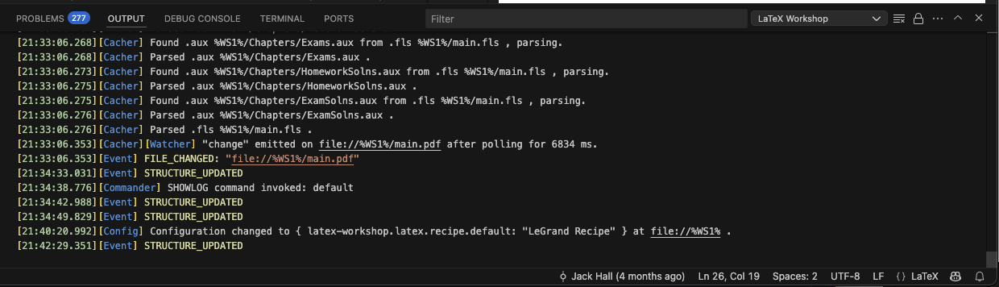

# Setting Up LaTeX Workshop in VSCode (with MAWF Build Support)

This short guide walks you through setting up LaTeX Workshop in VSCode on macOS (this is how I prefer to compile the text and work on updates), including custom build support for the LeGrand Orange Book template (used by MAWF).

---

### 1. Install LaTeX Workshop Extension in VSCode
- Open the Extensions pane in VSCode.
- Search for `LaTeX Workshop` (By James Yu) and install it.

### 2. Install MacTeX
- Download and install [MacTeX.pkg](https://tug.org/mactex/mactex-download.html)

### 3. Add LaTeX to your shell path
In your terminal, add the following to your `~/.zshrc` file:

```bash
export PATH=$PATH:/Library/TeX/texbin
```

Then run:

```bash
source ~/.zshrc
```

### 4. Restart VSCode

---

## Optional (for compiling MAWF / LeGrand Orange Book builds):

### 5. Open LaTeX Workshop settings
- Click the **Extensions** icon in the left pane.
- Click the ⚙️ (gear) icon next to **LaTeX Workshop**.
- Select **Settings**.

### 6. Search for "recipes"
- In the top search bar, type `"recipes"`.
- Under **LaTeX-workshop › LaTeX: Recipes**, click **Edit in settings.json**.

### 7. Add the following recipe to the `recipes` list:

```json
{
  "name": "LeGrand Recipe",
  "tools": [
    "pdflatex",
    "makeindex",
    "biber",
    "pdflatex",
    "pdflatex"
  ]
}
```

Make sure this object is inside the `latex-workshop.latex.recipes` array.

### 8. Save `settings.json` and return to the **Settings** tab

### 9. Set the default recipe
- Scroll down to **LaTeX-workshop › LaTeX › Recipe: Default**
- Enter: `LeGrand Recipe`

Close settings.

> **Note:** When you look at the **OUTPUT** from the LaTeX Workshop extension, you should see the configuration change to make `LeGrand Recipe` the default. It will look something like below:



---

That's all for now...
